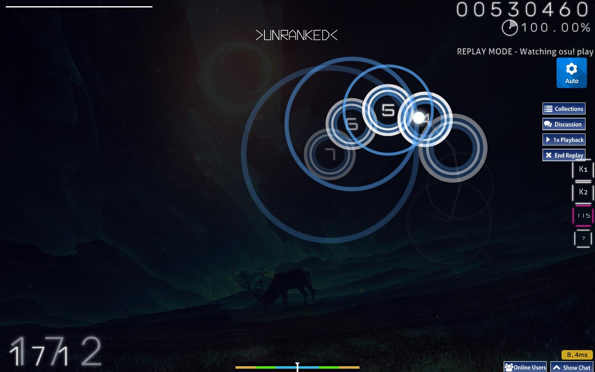

<h1>Egokara</h1> 

<h6>The ultimate skin for osu! stable with better UI and sound effect.</h6>

<h6>Coming soon</h6>

## Why is 'Egokara'?

* Well, it is very hard to explain but it is a complication from the original skin named 'Sakuraya' (kara) and 'Elysia - Herrscher of Human: Ego' (Ego). (Even I don't know why I named that💦)

## FAQ

* Q: Which mode does this skin support for?
    * A: It's supported for all modes (osu!, mania, taiko, catch)

* Q: Does it support for lazer? Will you created a same skin for lazer?
    * A: No, and I will not create another version for lazer since the UI of lazer was like sh1t, so I think i wouldn't create it.

* Q: This skin is so beautiful but some time when I playing it show a character image on some modes. Can you make it hidden?
    * A: I think osu! has a option to disable it. Just go to 'Options' and type 'Combo burst' and disable it.
